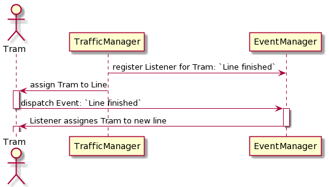
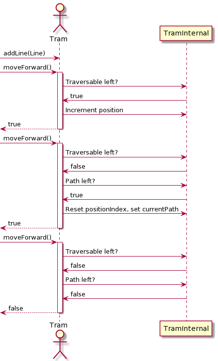
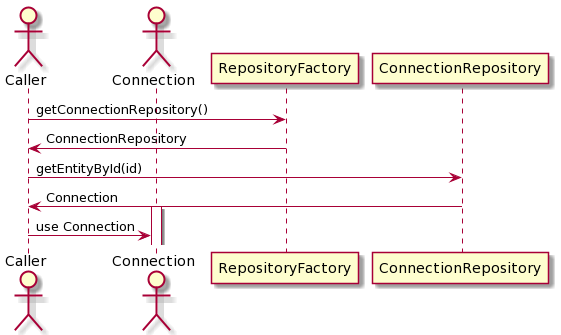

# Eco-Tram
### Program Description
* data model and base business logic for a tram management system
* uses event-based communication between single entities of the tram network, eg: Tram, Station, TrafficManager, etc.
* written with extensibility in mind
---
### Installation
<details>
  <summary>Dependencies</summary>

  * [JRE 15](https://www.oracle.com/java/technologies/javase/jdk15-archive-downloads.html)
  * [JDK 15](https://www.oracle.com/java/technologies/javase/jdk15-archive-downloads.html)
  * [Maven](https://maven.apache.org/)
  * [J-Unit](https://mvnrepository.com/artifact/junit/junit)
</details>
<details>
  <summary>Installation Steps</summary>

* `git clone https://github.com/fh-erfurt/eco-tram.git`
* `mvn build`
* `mvn test`
</details>

---
### General Design Decisions
* Usage of Singleton-Pattern for extensibility of currently static objects
* Usage of Repository- and Factory-Pattern for easier testing and entity instantiation
* Loose coupling of entities through usage of an EventManager as communication interface
* Testing of single functionalities through unit tests for easier development and debugging

---
### Program Flow Diagrams

[View PlantUML Text Diagrams](readme_assets/plantumlTextDiagrams.md)

#### Event Dispatch


<details>
  <summary>See more</summary>

#### General Tram Movement


#### RepositoryFactory

</details>

---
### Code Examples
#### Registering an EventListener
```java
Tram tram;
Line continuationLine;

// get the event entity tied to the trams traffic manager
// it is the instance the event will be emitted to
// see: Tram.java:205
var eventEntity = tram
        .getEventManager()
        .getEventEntity(tram.getTrafficManager());

// add listener for tram finished event
eventEntity.addListener("TRAM_PATH_END_REACHED",
        (entity, event, data) -> {
            // the line will have finished the line and get a new line
            // assigned for continuation
            ((Tram) entity).addLine(continuationLine);
        }
);
```
<details>
    <summary>See more</summary>

#### Usage of Repositories
```java
var tramRepository = RepositoryFactory.getInstance().getTramRepository();
var lineRepository = RepositoryFactory.getInstance().getLineRepository();

var tram = (PassengerTram) tramRepository.getEntityById(1);
var line = (Line) lineRepository.getEntityById(1);

// assigns the tram to it's first path
tram.addLine(line);

// the tram moves forward until no traversables are left
while (true)
{
    // check if the tram could move forward
    if (tram.moveForward());
        System.out.println(tram.getCurrentPosition().getName());
    else {
        System.out.println("Reached end of line."); // an event will also fire for this
        break;
    }
}
```

</details>

---