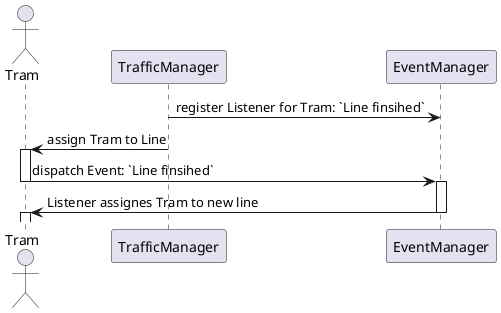
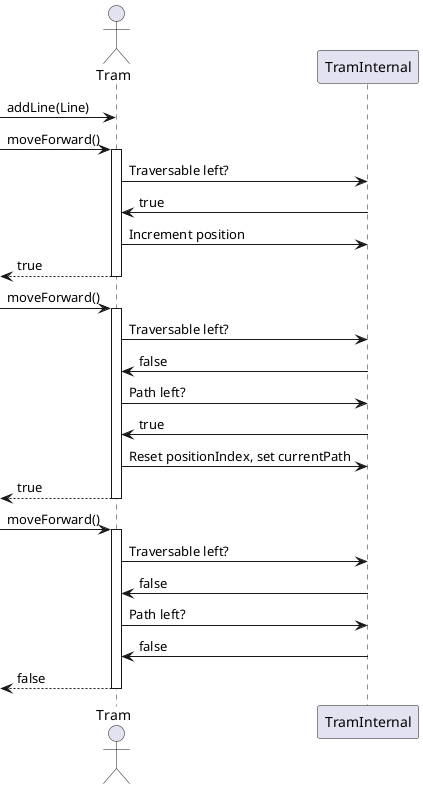
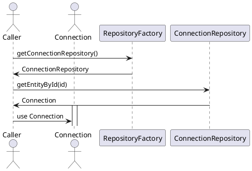

# PlantUML Text Diagrams for EcoTram

To convert the text diagrams into uml-images you can use http://www.plantuml.com/.
Paste the contents with `@startuml` and `@enduml` into the textarea and click on submit to generate the diagram.

### Event Dispatch

### General Tram Movement

### Repository Factory
